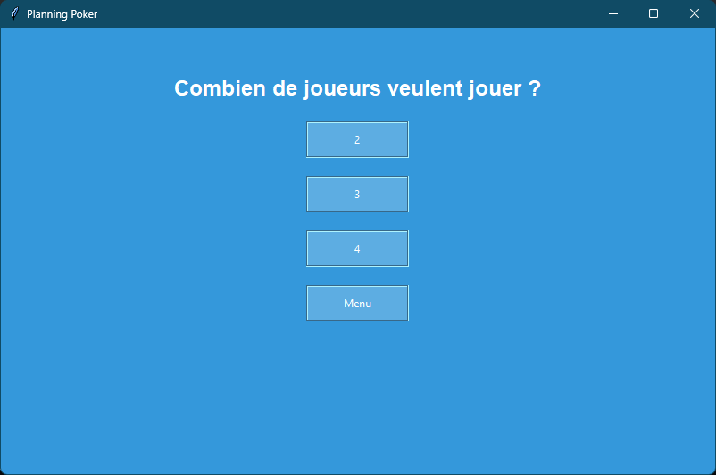

# Planning Poker Game

Une implémentation simple du jeu Planning Poker en utilisant Python et Tkinter, pour notre projet de Conception Agile

## Description

Le Planning Poker est un jeu d'estimation basée sur le consensus utilisée dans la gestion de projet Agile
Il s'agit d'une approche collaborative permettant aux équipes d'estimer l'effort ou la complexité des tâches d'un projet

## Fonctionnalités

- Naviguez entre menus (Menu principal, Options, Jouer, Tutoriel)
- Lancer des tests unitaires directement dans le code en lançant `TestUnitaires.py`
- Choisir le nombre de joueurs (de 2 à 4)
- Sélectionnez des pseudos pour chaque joueur
- Choisir un mode de jeu (Strict, Moyenne)

## Pour commencer

1. Installez Python s'il n'est pas déjà installé : [Télécharger Python](https://www.python.org/downloads/)

2. Clonez le dépôt :

    ```bash
    git clone https://github.com/Bees11111/PlanningPoker.git
    ```

3. Accédez au répertoire du projet :

    ```bash
    cd planningPoker-main
    ```

4. Exécutez le programme principal :

    ```bash
    python main.py
    ```

## Captures d'écran



